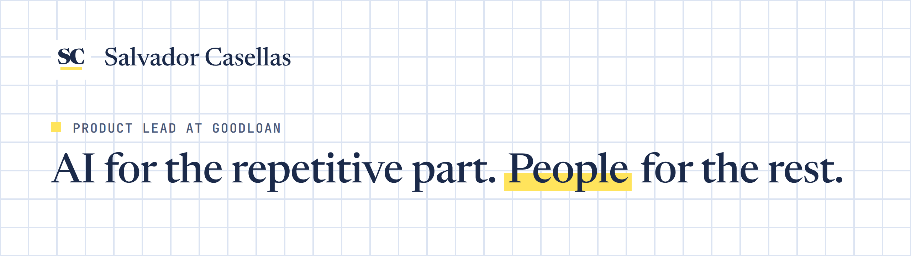

<picture>
  <source media="(prefers-color-scheme: dark)" srcset="assets/github-header-dark.png">
  
</picture>

I build product with AI agents, from design to code, and write up what I test: the real numbers, the workflows and the misses.

### What I'm building

-  **[GoodLoan.ai](https://www.goodloan.ai)**: Product Lead. Product, internal tooling, creative, and IT and tech.
-  **[Esensee Solutions](https://esensee-solutions.com)**: business solutions and strategic advisory, backed by custom tooling for client work and operations.
-  **Arcane Home**: my product studio for SaaS tools, digital products and AI automation. In stealth.

### What I write about

- **Technical AI breakdowns:** how models and agent workflows compare when you ship real work with them.
- **Lessons from real projects:** what worked, what broke, and what I'd do again.
- **Leading dev teams:** how work splits between people and agents, week to week.
- **AI in lending and tech:** where lenders put AI to work, and where it has to be careful.

### Tools

`Claude Code` · `Python` · `TypeScript` · `JavaScript` · `Java` · `HTML and CSS` · `Shopify`

### Find me

**[scasellas.github.io](https://scasellas.github.io)** · **[LinkedIn](https://www.linkedin.com/in/scasellas)**
